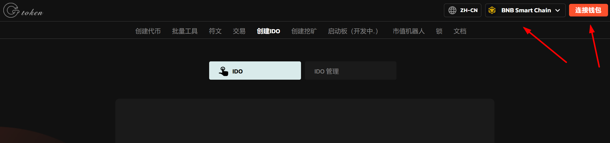

# 创建IDO

### 1、介绍

IDO指的是代币的首次发行。运用所有用户的资源和注意力来推动项目的发展，侧重通过社区参与和贡献来分发代币，而不是直接募集资金。在IDO中，项目方会发起一些悬赏任务，所有用户可以通过自己的时间和技能来完成这些任务，以此获得项目方发放的代币奖励。

### 2、操作步骤

提示：请先安装小狐狸钱包插件，教程：https://docs.gtokentool.com/fu-zhu-xin-xi/xiao-hu-li-qian-bao-an-zhuang-jiao-cheng

#### (1) 连接钱包

进入创建页面：https://www.gtokentool.com/idov2，点击右上角，连接小狐狸钱包，并切换到主网（这里以BSC测试网为例)

<figure><figcaption></figcaption></figure>

完成后，会看到您的 “链名称” 和 “钱包地址” ，如下图：

<figure><figcaption></figcaption></figure>

#### (2) 输入信息

假设我们创建一个为期30天的IDO， 填写如下：

* 启动时间：2024-05-09 09:30
* 结束时间：2024-05-09 09:30
* 使用什么参与IDO：TBNB
* 最低购买TBNB 数量：0.01
* 最高购买TBNB 数量：0.2
* 1TBNB = 10000  代币
* 推荐奖励类型：奖励BNB
* 推广奖励\
  1 级奖励 %：2
* 收款地址：0x46ed16F6BCb78d05d38E4765C10CF89e2a542D43

输入完成后，点击“确定”

\

<figure><figcaption></figcaption></figure>

### (3) 完成

点击 “确认创建” ，在小狐狸钱包上支付gas费，就完成了

<figure><figcaption></figcaption></figure>
